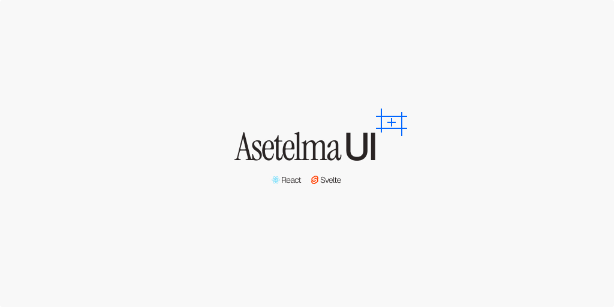

# My personal Design System in React & Svelte

This UI library is largely based on [Radix UI](https://www.radix-ui.com/) and [shadcn/ui](https://ui.shadcn.com/) as they both are solid UI systems. Focusing on dev experience this project uses Tailwind CSS for styling and ease of customization.

Check branches for React and Svelte implementations.
